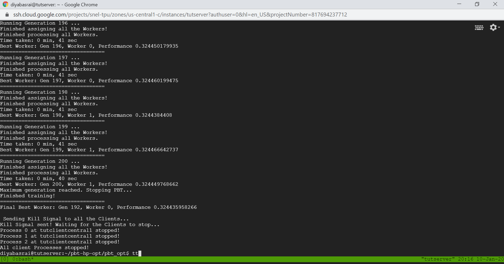

During a run, there is a variety of ways to check on the status of a run.

##SSHing into client VMs
We can SSH into the client VMs in order to look at individual workers or look at client log files. This can be helpful as this is where possible error logs will be stored. We SSH into clients in the same way we SSH into servers. Simply navigate to the compute engine, find the client VM you wish to enter, and click 'SSH.'

##Enter docker container
Once SSHed into a client machine, we can now enter the bash of the docker container, where we can view the individual workers running on tmux sessions or look at log files. This can be done by running the following command on the client machine. 
	
	docker exec -it docker_pbt /bin/bash

This command will make you enter the docker container running on the client VM. To view all tmux sessions, you can type the command.

	tmux -L pbt_server ls

This lists out all the tmux sessions. You can view any of these tmux sessions by using the command.

	tmux -L pbt_server a -t <tmux_session_name>

For more information on connecting to the Docker container in the client machines can be found at [https://linuxize.com/post/how-to-connect-to-docker-container](https://linuxize.com/post/how-to-connect-to-docker-container/).

##Viewing log files
Log files generated from each client machines can be useful to diagnose potential errors. These files are generated at the end of a run in your bucket located at [console.cloud.google.com/storage](https://console.cloud.google.com/storage). To view the log files, enter your `run` folder. There will be a `client_logs` folder which contains these log files. 

These files can also be viewed during the run by entering docker container and entering the temp folder with:

    cd /tmp

Now with `ls` you can see the list of log files.

##When is run over?
There are various conditions which would end a run, and in your server's tmux session, it should display the text seen in the following image: 

