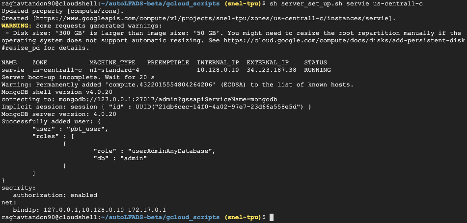

#Server Set-up error
Several failures in the pipeline can be attributed to failure in server creation, which is done in the `sh server_set_up.sh` step. If the Python script fails to run, its likely worth first attempting to [delete the server machine](https://cpandar.github.io/lfads-pbt/setupAddInfo/#stopping-starting-vms), and then re-run your server_set_up.sh script. After running the server_set_up.sh script, some of the last few lines of generated output should specify that the user has successfully been added to the MongoDB group, as seen in the below screenshot. 

If this isn't seen, likely MongoDB is failing to be set-up properly on the server machine. This can be checked by SSHing into the server machine and then running `sudo service mongod status`.

#Connection refused
If you see a `connection refused` exit output after running the Python script, this might have to do with incorrect server set_up. While not exactly clear, it is likely worth checking that `sh server_set_up.sh` was successfully ran. 

#Resource exhausted error
If you see a resource exhausted error, usually following `no response from process` outputs, this might be due to having too large of a dataset. This tutorial recommends keeping the sequence length less than 100 timesteps.

