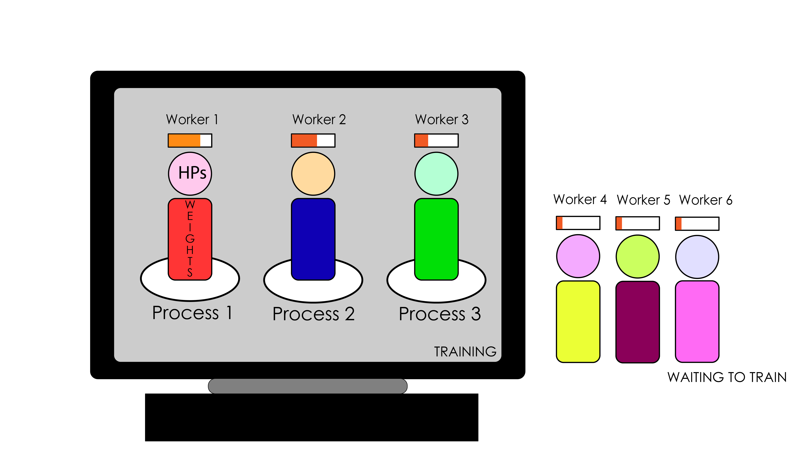

This section works through important concepts arise specifically from the practical implementation of PBT in code. 

##Exploit
Called after the population has been trained a certain amount of steps (```steps_to_ready```), exploit involves lower performing models replacing its HPs and weights with that of a higher performing model. At the moment, ```exploit``` is only implemented in a single way, called 'Binary Tournament.'

###Binary Tournament
In binary tournament, each member of the population randomly selects another member of the population,
and copies its hyperparmaeters and weights if and only if the other member’s performance is better. Whenever one member of the population
is copied to another, all parameters – the hyperparameters, weights of the generator, and weights of the
discriminator – are copied (from PBT paper). 

An animation of a 4 worker population using a binary tournament ```exploit``` method is shown.

<video width="100%" height="auto" controls autoplay loop>
  <source src="../media/binarytournament.mp4" type="video/mp4">
</video>


##Explore
Called if and only if a model has exploited the HPs and weights of a better performing, explore slightly alters the newly copied HPs. There are two choices for implementation of ```explore```.

###Perturb
Alters each HP value  by a factor of 1.2 or 0.8.

###Resample
Each hyperparameter is resampled from the original prior distribution defined with some probability.

##Processes vs Workers

Ideally, PBT runs an entire population of workers in parallel. However, due to limits in computational power it might be only able to maximally run a batch of those workers at at time. For instance, a particular TPU might be capped at running, say, three workers at at time. Thus, a PBT run using a single one of these TPUs might want to run a population of 15 workers, but would only be able to train three at a time.

In this case, the maximum numbers of workers would be trained until the they're ready to exploit and explore, in which case, they would "wait" and the next batch of workers would be trained up till that point until all the workers in the population are ready to exploit and explore.

For instance, in the following diagram, a population of 6 workers are trained 3 processes at a time.



