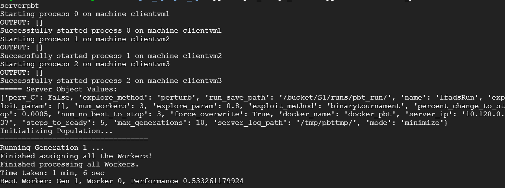

# Running PBT

The steps in this section are related to executing LFADS with PBT. 

## Upload data to buckets

The data uploaded to the bucket should look like this

The h5 file should be prefixed with `lfads`.

<video width="100%" height="auto" controls loop>
  <source src="../media/preparedatagyf.mp4" type="video/mp4">
</video>

## setting HPs and executing PBT

To start the PBT run, you need to mount the shared storage and start docker containers on the clients. Only after this are we ready to start a PBT run. These two steps and starting PBT can be done from the `pbt_script_multiVM.py` on the server machine. You can also tweak the hyperparameter ranges in the same script - 

`~/pbt_opt/pbt_opt/pbt_script_multiVM.py`

You can edit the pbt script with a text editor of your choice. In the start of the script you need to provide the tag name for the client machines (`machine_name`), name of the shared storage bucket created previously (`bucket_name`), name of the docker container (`container_name` - can be any alpha-numeric string), dir name for the data (`data_path`) and the path for saving the runs `run_path`

Refer to the [parameters](parameters/#parameters) section to know more about the params.

After you have set the HPs in the script you can finally start PBT from the pbt_opt/pbt_opt dir as follows - 

	cd pbt_opt/pbt_opt
    python pbt_script_multiVM.py

This will start PBT on all machines and the server should show the following message - 

